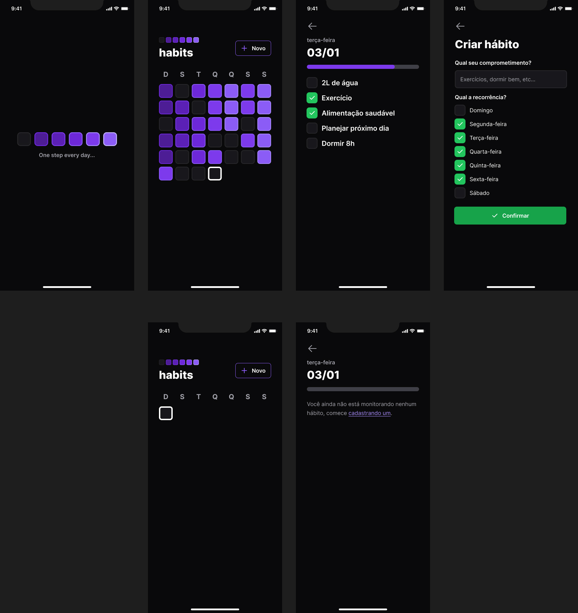

<h1 align="center"> Habits </h1>

NLW é um evento exclusivo e gratuito, promovido pela Rocketseat para ensino de tecnologias Mobile.  

  <a href="#-tecnologias">Tecnologias</a>&nbsp;&nbsp;&nbsp;|&nbsp;&nbsp;&nbsp;
  <a href="#-projeto">Projeto</a>&nbsp;&nbsp;&nbsp;|&nbsp;&nbsp;&nbsp;
  <a href="#-layout">Layout</a>&nbsp;&nbsp;&nbsp;|&nbsp;&nbsp;&nbsp;
  <a href="#memo-licença">Licença</a>

  

 

  

## 🚀 Tecnologias

Esse projeto foi desenvolvido com as seguintes tecnologias:

- JavaScript
- Git e Github
- Figma
- Nodejs
- React
- React Native
- Typescript

## 🚀 Bibliotecas

- tailwindcss
- dayjs
- nativewind
- expo
    

## 💻 Projeto

Habits é um app para poder ajudar a rastrear os hábitos.

## 🔖 Layout

Você pode visualizar o layout do projeto através [DESSE LINK](https://www.figma.com/community/file/1187422022288947321). É necessário ter conta no [Figma]

